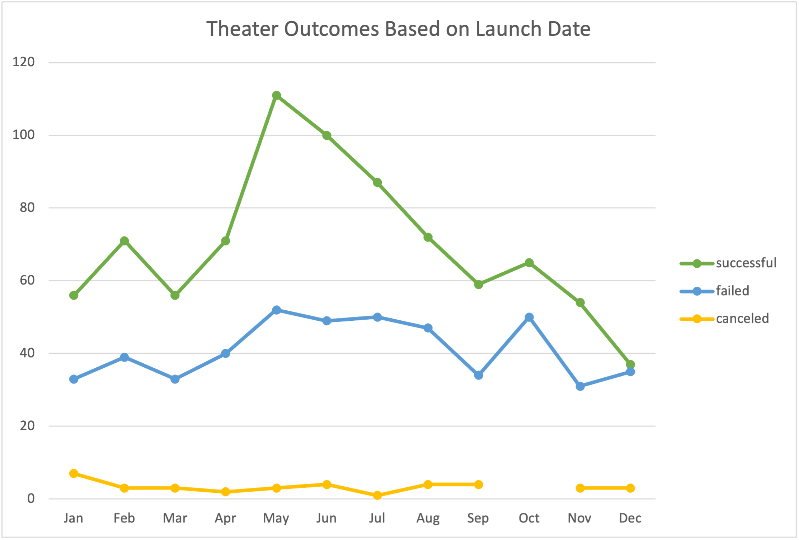
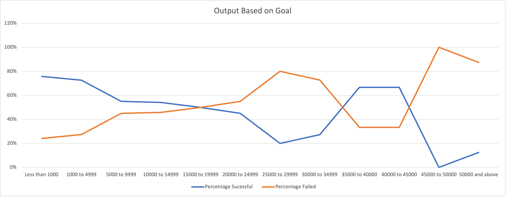

# Kickstarting with Excel -  John Morrissey 

## Overview of Project

In this project, I used pivot tables, graphs, and other excel funtions and tools draw useful conclusions from previously cleaned and gathered data. I reviewed data collected from attempted crowdsourcing campaigns on Kickstarter. Campaigns have a set goal of money to be raised and the data show whether or not the goal is reached for each project. These data were analysed to determine what factors make a successful launch.

### Purpose

The Purpose of this project is to gain insightful knowledge on product launches from a large set of data. We will be looking into what makes a launch successful to help guide future launches.

## Analysis and Challenges

Pivot tables and charts were used to gain a more clear picture of what factors create sucessful launches. We dive into when the project is launched, and its effects on success. Goals are catagorized to help analyse what goals have a higher chance of success.

### Analysis of Outcomes Based on Launch Date
 
The launch date of goals are broken down by month of launch. My hypothesis is that some types of campaigns are seasonal, and this analysis can support that hypothesis. Product categories and sub-categories are taken into consideration. Different products may have different seasonality effects. For example, a play may have better success in the warmer months when people are traveling, while a new gadget or product may have more success around the holidays while people are buying presents. 

 The above table shows the cumulative number of theater launches broken down by month. The data includes launches from 2009 to 2017. There is a clear indication that campaigns started in the summer months have a higher rate of success.  The percentage of failed campaigns is higher in the last three months of the year. 

### Analysis of Outcomes Based on Goals

Goals are broken down into 11 categories based off the amount of money needed to meet the goal. Analysis was then done to determine which categories are more successful. Successful, failed, and cancelled goals are broken down into percentages.

The above table shows us campaigns for plays from 2009 to 2017. Goals are catagorized into increments of $5,000 and plotted. The most sucessful goals were in the less than $10k range and $35k to $40k range. Any goal above $45k had a highly increased chance of a failed campaign. 

### Challenges and Difficulties Encountered

Challenges With the Data included the large amount of categories and subcategories it contains. Launches for a new product are very different from launches for music and plays. If one were to look at all the data and not break it down by category, they would most likely draw incorrect conclusions. For instance with seasonality, when you look at the data as a whole, seasonality is shown. But if you look at the music or games category there is no apparent seasonality. One might look at the data too broadly and draw the wrong conclusions. If I were doing analysis on my own, I would eliminate the catagories for goals when graphing to get a more accurate depiction. 

My personal difficulties revolved around adapting to excel for mac. The layout was signifigantly different from Excel for Windows. The tables and charts are constructed and edited are different. I also had issues with range selection for `COUNTIFS()` functions where my ranges were not all the same size. My excel crashed several times, and I lost an hours worth of work.  

## Results

### What are two conclusions you can draw about the Outcomes based on Launch Date?

Sucessful theatre oucomes are seasonal, peak in May, and remain high through August. Failed outcomes are proportionally higher in the last three months of the year, with December launches reaching an almost 50% fail rate.  If one wants to launch a sucessful campaign, they should launch their campaign in the summer months (May-August) and avoid the last three months of the year (October-December). 

### What can you conclude about the Outcomes based on Goals?
        
In terms of goals, the most successful goal amounts are those with ranges < $10k and $35k-$40k. Goals are significantly less sucessful above 45k and in between $25k to $35k. If one wants a sucessful goal, they should not make it above $45k. $25k to $30k should be avoided as well. $40k goals have a much higher sucess rate than 50k goals. 

### What are some limitations of this dataset?

The dataset lackes information on how the campaigns were marketed. My hypothesis is that a campaign will fail if no one has heard of it. I believe marketing plays a signifigant role in a successful campaign. I would also like to see how much traffic each campaign recieved on the kickstarter site which would give us an idea how much exposure to the public the campaign had. Also, it would be interesting to plot the data against the stock market to see if there is any correlation between successful campaigns and market sediment. I would assume there are going to be more failed campaigns during a recession.

### Recommendations for Additional Tables and Graphs 

I would like to see a graph of the percentage of failed campaigns vs goal amount. I think it would demonstrate the data better rather than having two lines showing successful and failed campaigns. 